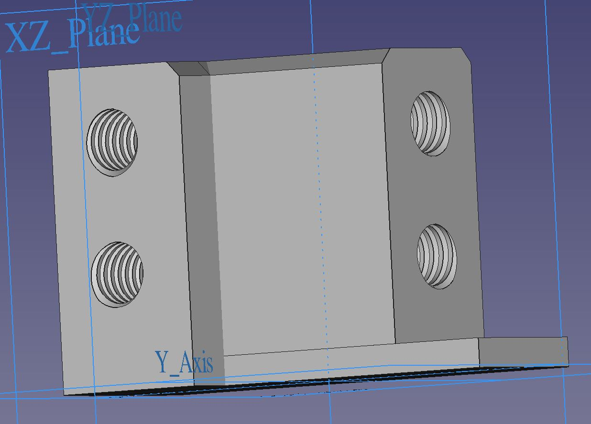
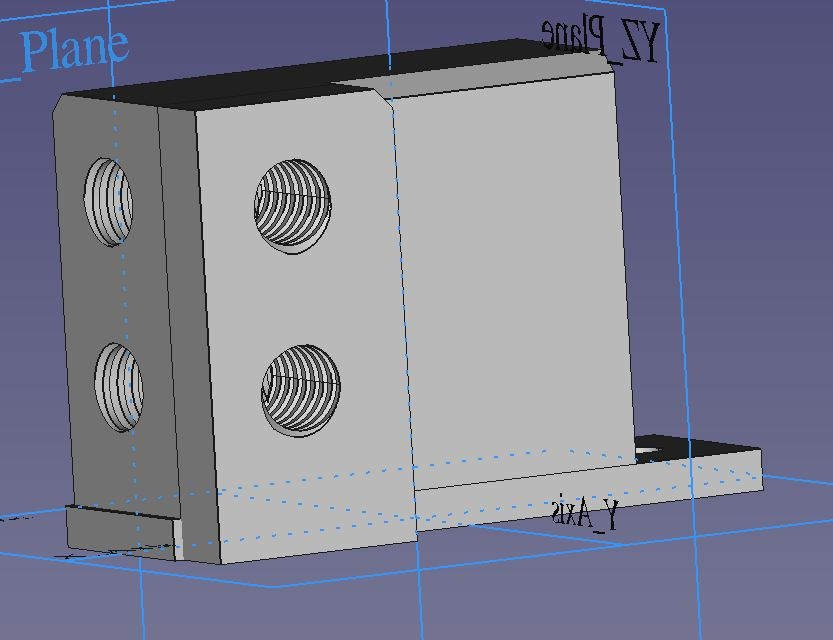

# Hardware_STM32F4_Vario
Soaring Vario Hardware design. 

## PCB design 

## 3D CAD Parts
Static and pitot pressure shall be connected using 5mm inner diameter houses which are typical in a glider

