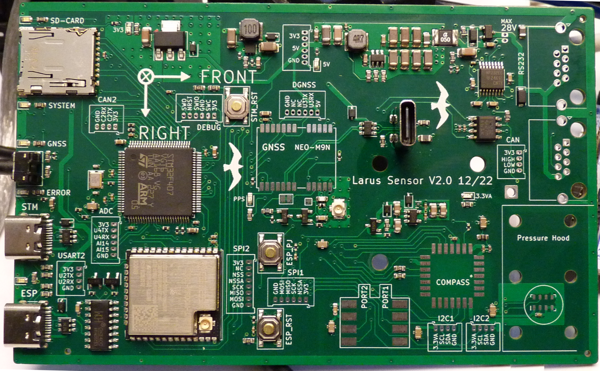
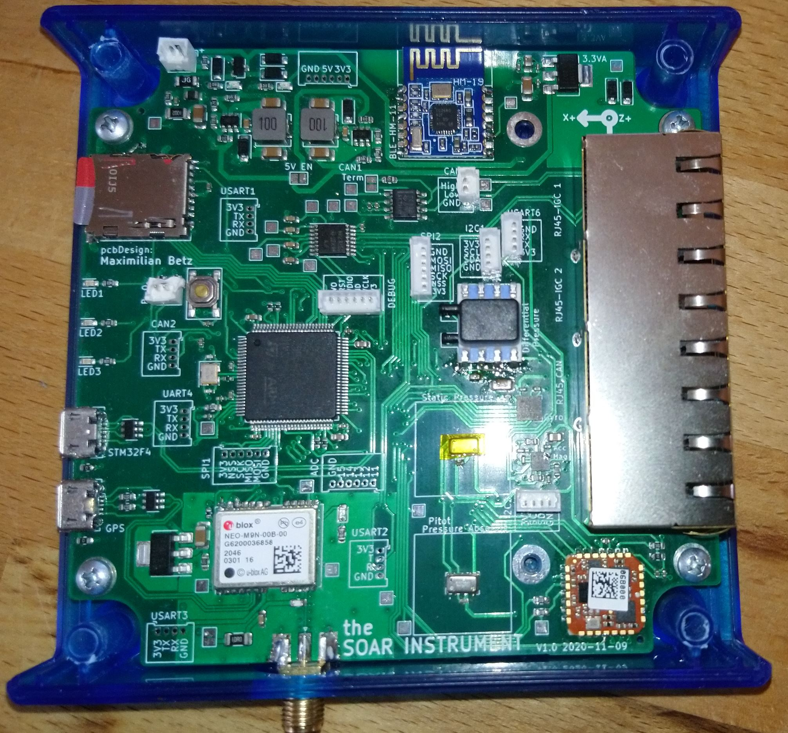
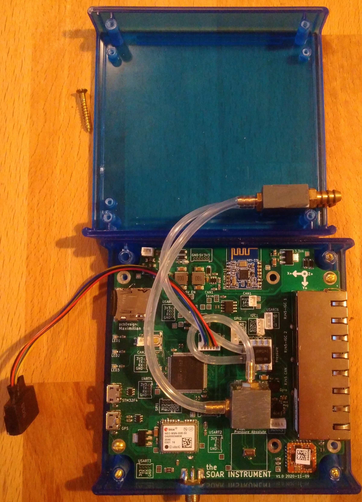
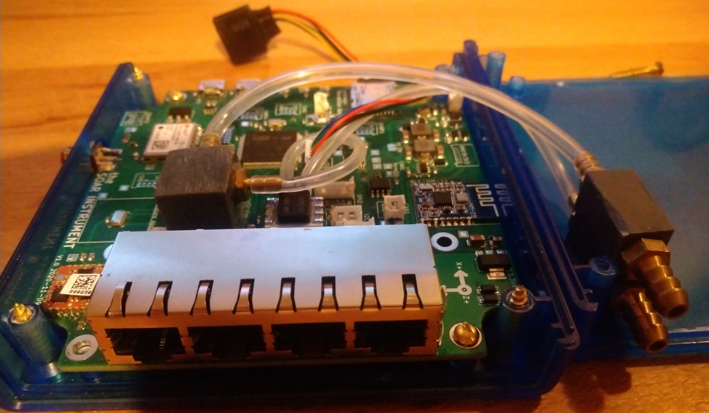

# PCB design for Larus Sensor 

## Facts
- STM32F407 for signal processing 
- U-Blocks M9N GNSS
- xSense MTi1 IMU
- MS5611 static pressure sensing
- HSCMRRV001PG2A3 pitot pressure sensing
- Micro-SD for logging
- ESP32 for Bluetooth and Wifi Connectivity
- CAN Bus via RJ45
- RS232 via RJ45
- USB connectors for STM32, ESP32, GNSS

## PCB design V2.0

## Assembled sensor V2.0
- TODO

## PCB design V1.0

## Assembled sensor V1.0
Static and pitot pressure shall be connected using 5mm inner diameter houses which are typical in a glider

