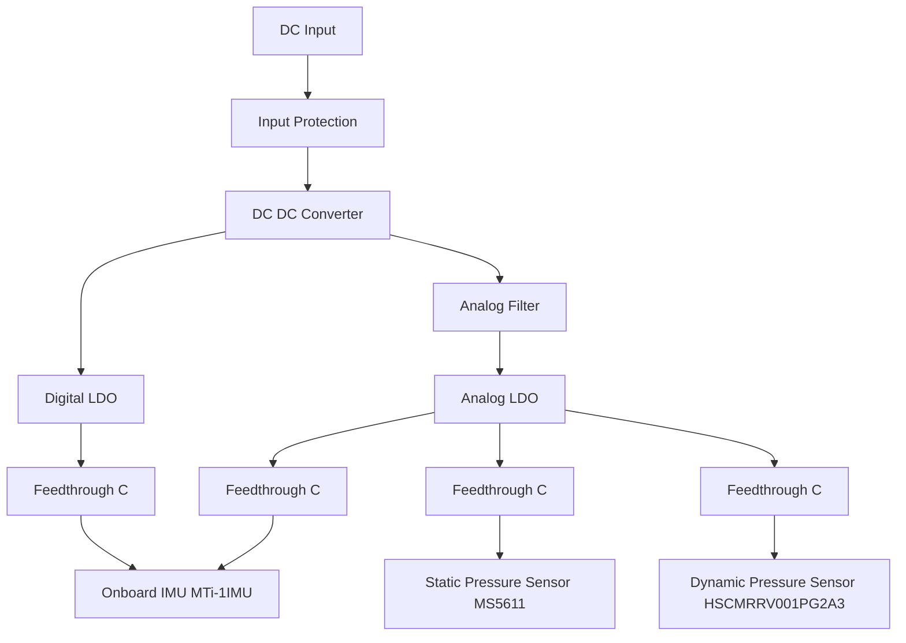

# Power supply

This document presents the design choise made in the power supply of the larus sensor hardware

## Overview

The following block diagram gives an overview of the power distribution on the board

## DC DC Converter

 - 1.4 MHz switching frequency (1.2 MHz--1.6 MHz)
 - Output voltage ripple ~20mV (Vin 12V, Vout 3.3V, 0--1.2A)

### Design
regulated FB Voltage =0.791-0.823V
$$V_{OUT} = V_{FB} \frac{R_1+R_2}{R_2}$$
with regulated FB Voltage = 0.791V--0.823V, R1 = 49.9KOhm 1%, and R2 = 9.53K 1%
Vout = 4.85V--5.22V

Input capacity: 

 ### TODO
 
 - [ ] verify switching frequency
 - [ ] verify output voltage ripple
 - [ ] verify duty cycle 
 - [ ] verify stability with max calculated current

## Analog LDO

A compromise between performance, availability (JLCPCB) and price had to be made. 
The SK6013 (LCSC#C2682741 or C2682747) will be used
Both footprints should be placed on the board such that no layout change is needed when there is a supply shortage.

### Important Parameters

 - Outputnoise 20 uVRMS (10 Hz--100kHz)  
 - Input voltage range 2.5-6.5V
 - Iout < 300 mA
 - PDmax 0.3W (SOT23-5L 0.3W, DFN1x1-4L 0.6W)
 - max. Dropout Voltage 350mV @ 300mA; 250mV @ 200mA

### Current Consumption Overview

| device | typ. current (mA) | max. current (mA) | measured (mA) |
|--|--|--|--|
| MS5611 			|  |  |  |
| HSCMRRV001PG2A3 	|  |  |  |
| MTi-1IMU 			|  |  |  |

### Design
Dropout min. 500mV such that the LDO has some regulation headroom

### TODO

- [ ] add second footprint
- [ ] add input capacitor (1uF)

### Alternatives
If the supply noise is too large we could switch to the TPS7A94 (Texas Instruments)

## Analog Filter

### Requirements

 - Suppress switching noise of the DC-DC converter (>1.2 MHz)
 - Suppress low frequency supply noise
	 - as we have in the glider typically a relatively clean supply (Accumulator based supply) it is perhaps not so critical (we don't have to expect 50Hz line noise)
 - Dropout voltage has to be smaller than 0,9V (to present sufficient input voltage to the LDO) with 50mA current

### Design 
      +------------\   />-------
      |      R     -----  Q   
      |    _____     |        | 
    --+---|_____|----+        |
                     |        | Vout
     |  Vin         === C     |
    \/               |       \/
                     |
    -----------------+----------

Transistor choise:
 - NPN type (maybe darlington)
 - low base emitter voltage $U_{BE}$ (<0.9V)
 - high current gain $h_{fe}$
 - medium $f_T$

| name | $h_{fe}$ | $f_T$ (MHz)| UBE | max $I_C$ (mA) | price | JLCPCB
|--|--|--|--|--|--|--|
| MMBT5089 | 400-1200 | 50 |0.5V@I_C 10mA | 100 | 0.0206$ |C116160|

RC Filter:
calculate max R:

$$ R_{max} = \frac{(U_{drop}-U_{BE})*h_{fe}}{I_{max}} = 2400 \Omega$$

reuse of i2C pullups (2k2 (JLCPCB C25879)) and the capacitor of the LDO (1u 0805 (JLCPCB C116352)) leads to a 3dB corner freq of ~75Hz which is suffently small. 

## Blocking Capacitors for Each Component

### TODO

- [ ] add Murata NFM21PC105B1C3D (LCSC# C92518)  in front of each analog component

